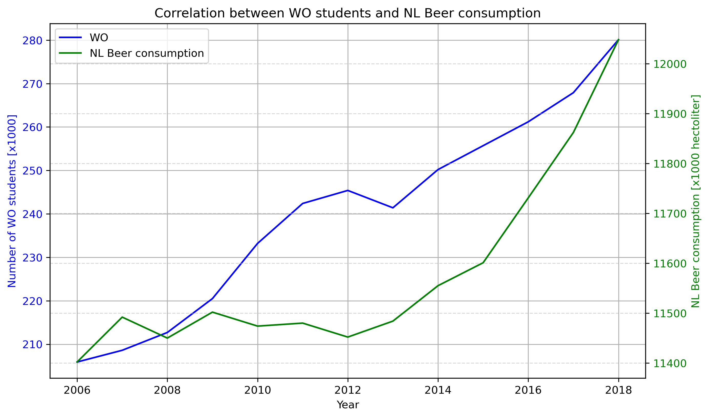

13446126

MCC Van Dyke et al., 2019
JT Harvey, Applied Ergonomics, 2002
DW Ziegler et al., 2005

## Generated plot

This plot shows the joined increase of beer consumption and WO students. Notably, however, the beer consumption only increases marginally (~11%), whereas the amount of students increase more significantly (~36%). While the two appear correlated, it remains debatable to what extent causation can be observed.